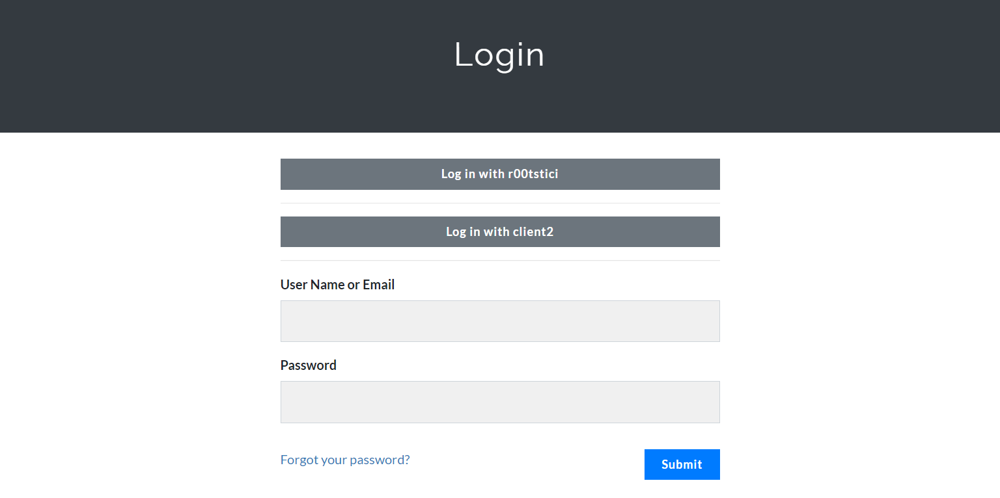

# CTFd-SSO-plugin

This plugin allows login and registration via OAuth2.

Works perfectly with a large variety of identity management solutions, like KeyCloak.

## Installation

1. Clone this repository to [CTFd/plugins](https://github.com/CTFd/CTFd/tree/master/CTFd/plugins).
2. Install required python packages. If you are using Docker, it is done by rebuilding the container. Instead, if you are using other hosting solutions, you can install them with the command `pip3 install -r requirements.txt` from the plugin folder (`CTFd/plugins/CTFd-SSO-plugin`).
3. Edit the `[extra]` section of `CTFd/config.ini` adding these two values:
   - `OAUTH_ALWAYS_POSSIBLE`: set `True` if you want to allow registration via OAuth even if normal registration is turned off. Default is `False`.
   - `OAUTH_CREATE_BUTTONS`: set `True` if you want to automatically add the OAuth login buttons in the login page. Default is `False`.
4. Start or restart CTFd.
5. In the `Admin Panel` go to `Plugins`>`ctfd-sso`. There you can view and delete existing clients, or add a new one by pressing plus symbol.
6. Insert a client name (it will be shown on the button) and the other information according to the identity provider. Then press `Add`.
7. Log in :)

## Admin accounts

If you want to automatically create admin accounts via the Identity Provider, make sure that the API Endpoint returns a key `roles` containing an array. The first element of that array will be set as the user role in CTFd.

For example if an user should be admin, the Identity Provider should return something like: `{"preferred_username": "username", "email": "example@ctfd.org", "roles": ["admin"]}`

The allowed roles for CTFd are `admin` and `user`, but the latter is set by default.

## Login buttons

If configured properly, this plugin will attempt to automatically insert the login buttons in the login page. It might fail if the theme isn't the original one. In this case or if you want to create some custom buttons, they should point to `sso/login/<client_id>`.

## Screenshots

